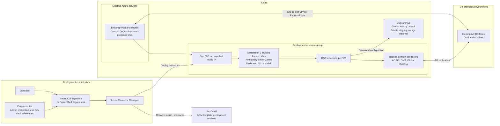

# Replica Domain Controllers - Quickstart

## Architecture



## Blog Posts - IT Ops Talk (Microsoft Tech Community)
1) https://skuehn.io/repldc1 - Introduction to Building a Replica Domain Controller ARM Template
2) https://skuehn.io/repldc2 - Pre-Requisites to Building a Replica Domain Controller ARM Template
3) https://skuehn.io/repldc3 - Design Considerations of Building a Replica Domain Controller ARM Template
4) https://skuehn.io/repldc4 - Digging into the Replica Domain Controller ARM Template Code
5) https://skuehn.io/repldc5 - Desired State Configuration Extension and the Replica Domain Controller ARM Template
6) https://skuehn.io/repldc6 - Desired State Configuration code: How to troubleshoot the extension

## Background
Most enterprises choose to extend their Active Directory Domain Services (ADDS) environment into Azure as part of their digital transformation. Many applications and server environments still rely upon legacy authentication methods like Kerberos for access. Rather than build out replica domain controllers in Azure manually, this template automates both the build and configuration process to help speed up the process. 

## Prerequisites
1. Connect the existing Azure VNet to the on-premises network through a [site-to-site VPN](https://github.com/Azure/azure-quickstart-templates/tree/master/quickstarts/microsoft.network/site-to-site-vpn-create) or ExpressRoute with private peering. Configure the VNet's [custom DNS servers](https://learn.microsoft.com/azure/virtual-network/manage-virtual-network?WT.mc_id=ept-0000-shkuehn#change-dns-servers) to use on-premises domain controllers so the VMs can locate the domain during domain join and promotion. This template references an existing VNet and subnet; it does not create the hybrid connection or configure VNet DNS.
2. Create a [Key Vault](https://learn.microsoft.com/azure/key-vault/quick-create-portal?WT.mc_id=ept-0000-shkuehn) in the subscription and enable **Azure Resource Manager for template deployment**. The sample parameters file uses Key Vault references for credentials; replace its environment-specific values before deployment.
3. Before deploying, configure [Active Directory Sites and Services](https://learn.microsoft.com/windows-server/remote/remote-access/ras/multisite/configure/step-2-configure-the-multisite-infrastructure?WT.mc_id=ept-0000-shkuehn) in the on-premises forest. AD sites group well-connected subnets so domain controllers can replicate efficiently and clients can locate an appropriate domain controller. Ensure the Azure subnet is associated with the intended AD site; if `adSiteName` is empty, AD selects a site based on the subnet.

## What Gets Deployed
- One domain controller VM per address in `ipAddresses`, each with a static private IP on an existing subnet. Add more addresses to deploy more domain controllers.
- Generation 2 Windows Server images (2019, 2022 or 2025) with Trusted Launch (Secure Boot and vTPM) enabled.
- A separate managed data disk (host caching set to None) mounted as `F:` for the NTDS database, logs and SYSVOL.
- Either an Availability Set or Availability Zones, chosen with `availabilityOption`.
- The PowerShell DSC extension, which joins each VM to the domain and promotes it to a replica domain controller (DNS and Global Catalog included) using [ActiveDirectoryDsc](https://github.com/dsccommunity/ActiveDirectoryDsc), [ComputerManagementDsc](https://github.com/dsccommunity/ComputerManagementDsc) and [StorageDsc](https://github.com/dsccommunity/StorageDsc).

## Parameters
| Parameter | Required | Description |
| --- | --- | --- |
| `dcPrefix` | Yes | Name prefix for the domain controllers (e.g. `azdc` produces `azdc01`, `azdc02`). |
| `domainToJoin` | Yes | FQDN of the existing domain. |
| `domainAdminUsername` / `domainAdminPassword` | Yes | Account used to join the domain and promote the domain controllers. |
| `safeModeAdminPassword` | No | DSRM password. Defaults to the domain administrator password when left empty, but a separate password is recommended. |
| `locAdminUserName` / `locAdminPswrd` | Yes | Local administrator for the VMs. |
| `ipAddresses` | Yes | Static private IPs, one per domain controller. |
| `existingVnetName` / `existingVnetResourceGroup` / `existingSubnetName` | Yes | The existing network the domain controllers are placed in. |
| `adSiteName` | No | AD site for the domain controllers. When empty, AD chooses the site from the subnet. |
| `winOSVer` | No | Windows Server image SKU. Defaults to `2022-datacenter-azure-edition`. |
| `vmSize` | No | Defaults to `Standard_D2s_v5`. |
| `dataDiskNumber` | No | Windows disk number of the data disk: `1` for VM sizes without a local temp disk (default), `2` for sizes with one (e.g. `Standard_D2ds_v5`, `Standard_DS2_v2`). Getting this wrong can place NTDS on the temp disk, which is wiped when the VM is deallocated. |
| `dataDiskSizeGB` | No | Defaults to 64. |
| `storAcctType` | No | Disk SKU. Defaults to `Premium_LRS`. |
| `availabilityOption` | No | `AvailabilitySet` (default) or `AvailabilityZones`. |
| `availSetName` | No | Availability Set name. Defaults to `<dcPrefix>-avset`. |
| `location` | No | Defaults to the resource group location. |
| `_artifactsLocation` / `_artifactsLocationSasToken` | No | Base URI (with trailing slash) of the folder containing `DSC/promote-adds.zip`, plus an optional SAS token. |

## Deployment
Sign in with `Connect-AzAccount`, update `azuredeploy.parameters.json` for your environment, then run:

```powershell
./Deploy-AzureResourceGroup.ps1 -ResourceGroupName az-ad -ResourceGroupLocation eastus
```

Add `-ValidateOnly` to validate the template without deploying. Add `-UploadArtifacts` to rebuild the DSC archive from your local `promote-adds.ps1` and stage it in a private storage container, which lets you test DSC changes before pushing them to GitHub.

To deploy with the Azure CLI instead (locally after `az login`, or from Azure Cloud Shell in Bash), run:

```bash
./deploy.sh -g az-ad -l eastus
```

Add `-w` to preview the changes with what-if, `-v` to validate only, or `-s <subscription>` to target a specific subscription. Run `./deploy.sh -h` for all options.

## Making Changes
- `azuredeploy.bicep` is the source template. After editing it, regenerate the JSON with `az bicep build --file azuredeploy.bicep --outfile azuredeploy.json`.
- The DSC extension does not download modules, so `DSC/promote-adds.zip` must contain the configuration script and every module it imports. After editing `DSC/promote-adds.ps1` or changing module versions, run `DSC/Build-DscArchive.ps1` and commit the rebuilt zip.

## Additional Considerations for Load Balancing - Do I? Or don't I?
Domain controllers do not need to be load balanced. Active Directory already has load balancing techniques built-in. Windows clients know how to locate redundant domain controllers in each site and how to use another domain controller if the first is unavailable. There is no need to perform additional load balancing as long as you have redundant domain controllers. Think of an Active Directory Site as a "load balancer," because clients in that site will randomly pick one of the domain controllers in the same site. If all the domain controllers in a site fail or if the site has no domain controllers, then clients will pick another site (either next-closest site or at random). Whether you use an Availability Set or Availability Zones, load balancing is not required.

## Benefits
1) Provides access to the same identity information that is available on-premises.
2) Companies can authenticate a user, service, and/or computer accounts on-premises and in Azure.
3) Companies do not need to manage a separate AD forest, as the domain in Azure can belong to the on-premises forest.
4) Companies can apply group policy defined by on-premises Group Policy Objects to the domain in Azure.

## Possible Challenges
1) Companies must deploy and manage their own AD DS servers and domain in the cloud.
2) There may be some synchronization latency between the domain servers in the cloud and the servers running on-premises.
